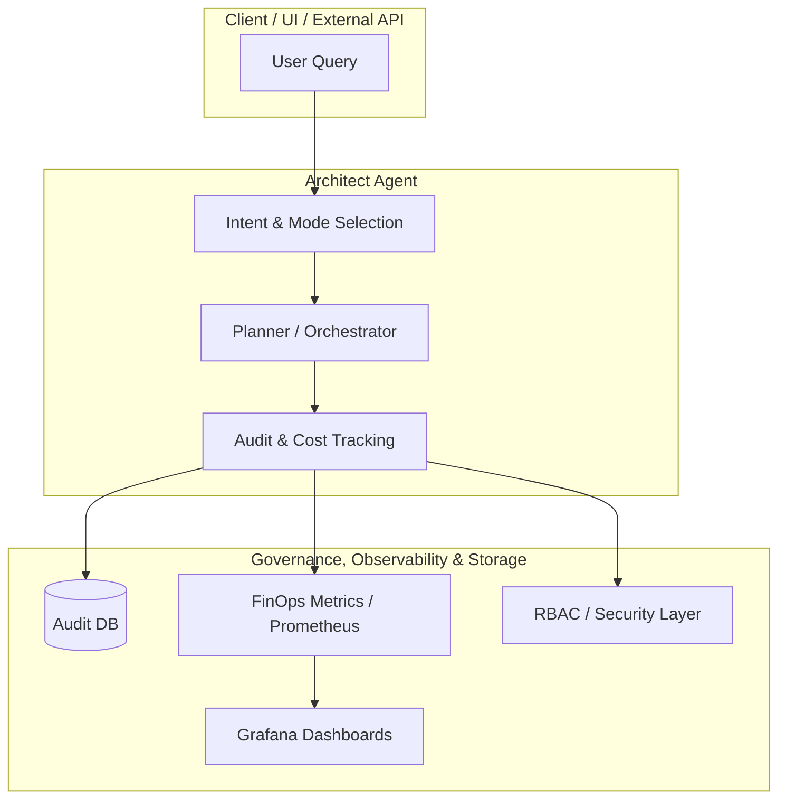
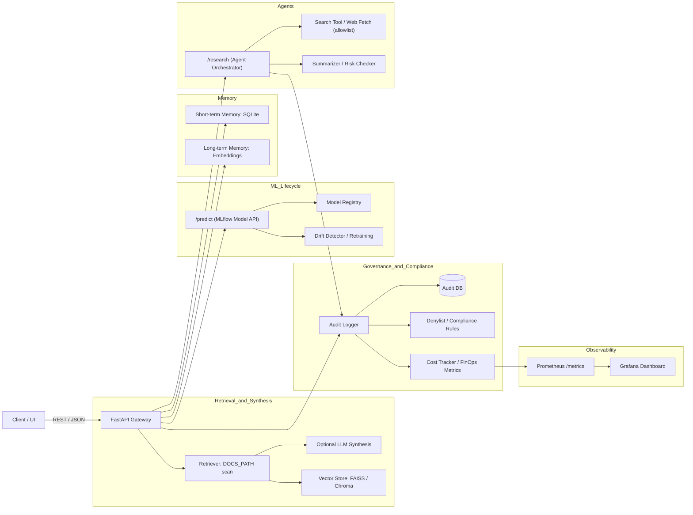

# 🧠 AI Architect
> **Architect-first open-source platform for designing safe, observable, and cost-aware AI systems.**  
> Primary interface: **/architect** — a meta-agent that orchestrates RAG, agents, and ML models to produce grounded, auditable plans.

---

[](https://github.com/bridge-intelligence-lab/ai-architect/actions/workflows/ci.yml) [](.github/workflows/ci.yml) [](LICENSE) [](pyproject.toml) [](docs/README.md)[](https://github.com/astral-sh/ruff) [](https://fastapi.tiangolo.com)


## Why AI Architect
**AI Architect** is a reference implementation for running LLM and agent services with **production controls**: RBAC, audit trails, cost/FinOps metrics, retrieval, and MLOps, on a FastAPI + ports-and-adapters core. Most portfolio projects show what an LLM service can do; this one focuses on how to **operate** one — who's allowed, what it cost, what it did, and how to prove it.

- **Transparent** by design — audit logs, hashed request/response pairs.
- **Observable** — Prometheus `/metrics` + Grafana dashboards.
- **Cost-aware** — per-request token accounting and FinOps metrics (real per-model $ cost via LiteLLM is on the roadmap).
- **Governed** — RBAC, retention sweeps, and prompt registries.

> **Project status:** a reference implementation you can run locally. Out of the box the LLM runs in a deterministic offline **stub** unless a provider key is set; retrieval ships a **keyword/deterministic baseline** (vector retrieval is next on the roadmap); the architect runs a structured **deterministic planner** (a LangGraph tool-loop agent is on the roadmap). Shipped vs planned lives in [docs/MODERNIZATION_PLAN.md](docs/MODERNIZATION_PLAN.md).

---

## 💡 Use Cases
| Scenario | Description |
|-----------|--------------|
| **Architect Assistant** | Ask architectural or implementation questions and receive structured, grounded responses from the system’s own docs. |
| **Policy Navigator** | Explore compliance and governance policies using grounded QA. |
| **PII Remediation** | Detect, redact, and audit sensitive data with explainable steps. |
| **Risk Scoring** | Classify incidents with heuristic or MLflow-tracked models. |
| **MLOps Demonstrator** | Observe model training, drift detection, and registry integration. |

> The **Architect Agent** is the main entry point — all other endpoints act as modular tools or sub-agents.

---

## 🧭 Architect Orchestration Flow

> Current behavior: `/architect` produces structured plans and citations while emitting audit and metrics events.

---

## ⚡ Quickstart
```bash
# 0) Setup
git clone https://github.com/bridge-intelligence-lab/ai-architect
cd ai-architect
cp .env.example .env
# If you skip .env, export PROJECT_GUIDE_ENABLED=true to enable /architect

# 1) Create environment
python3 -m venv .venv
. .venv/bin/activate
pip install -e .

# 2) Optional: ingest docs for RAG
python scripts/ingest_docs.py

# 3) Run locally
uvicorn app.main:app --host 0.0.0.0 --port 8000

# 4) Query the Architect Agent (guide mode)
curl -sX POST localhost:8000/architect \
  -H "Content-Type: application/json" \
  -d '{"question":"Design a RAG pipeline with drift monitoring"}' | jq .

# Brainstorm mode
curl -sX POST localhost:8000/architect \
  -H "Content-Type: application/json" \
  -d '{"question":"How does the router decide intents?","mode":"brainstorm"}' | jq .
```
**UI:** http://localhost:8000/architect/ui
Note: /architect is feature-gated. Ensure PROJECT_GUIDE_ENABLED=true (in .env or environment) before calling it.

**MCP:** the same capabilities are exposed over the Model Context Protocol
for Claude Desktop / Claude Code / any MCP client — tools `architect_plan`,
`retrieve_docs`, `detect_pii`:

```bash
ai-architect-mcp        # stdio server (or: python -m app.mcp_server)
```

Backend flags apply unchanged (`RAG_BACKEND`, `AGENT_BACKEND`,
`LLM_PROVIDER`). See [ADR-0008](docs/adr/0008-mcp-server.md).

---

## 🧱 Repository Layout
| Folder | Purpose |
|--------|----------|
| `app/routers/` | FastAPI endpoints (architect, query, research, risk, pii, memory) |
| `app/services/` | Core services: RAG, agents, risk, MLflow integration |
| `app/utils/` | Audit, RBAC, cost tracking, prompt registry |
| `db/` | SQLAlchemy models and migrations |
| `ml/` | ML training, drift, and registry scripts |
| `scripts/` | Utilities (ingestion, retention sweep, OpenAPI export) |
| `docs/` | System and feature documentation |

Complete file map → `docs/components.md`

---

## 📚 Documentation
- [Docs index](docs/README.md)
- [Getting started](docs/getting_started.md)
- [API](docs/api.md)
- [Deploy](docs/deploy.md)
- [RAG](docs/rag.md) (vector backends: [docs/rag_vector_backends.md](docs/rag_vector_backends.md))
- [Memory](docs/memory.md)
- [Security](docs/security.md)
- [Observability](docs/observability.md)

## 🧩 System Architecture



---

## 🔒 Governance & Observability
- **Audit rows** per request (role, hashes, latency, flags)
- **RBAC** via `X-User-Role` (`guest`, `analyst`, `admin`)
- **FinOps**: token & cost metrics at `/metrics`
- **Retention**: `scripts/sweep_retention.py` for old audits
- **Prompt Registry**: versioned YAML under `prompts/`

Full details → `docs/observability.md`, `docs/security.md`

---

## 🗺️ Roadmap (Condensed)
| Phase | Focus | Status |
|-------|--------|--------|
| 0–2 | Core APIs, retrieval (keyword baseline), Audit, Metrics | ✅ Done |
| 3–4 | Orchestration (deterministic planner), RBAC, Grafana, Deploy Recipes | ✅ Done |
| 5–6 | PII detection, Risk ML integration, Router v2 | 🚧 In Progress |
| 7–8 | Memory (short + long term) | ✅ Done |
| 9 | Architect agent on LangGraph (`AGENT_BACKEND=langgraph`) | ✅ Done |
| 10 | Real vector retrieval (`RAG_BACKEND=vector`), LiteLLM cost tracking, MCP server | ✅ Done |
| 11 | Presidio PII backend, CI coverage gate | ✅ Done |
| 12+ | Pinecone backend, role-scoped MCP, memory in the LangGraph loop | 🧩 Planned |

> Full roadmap and build-vs-buy rationale: [docs/MODERNIZATION_PLAN.md](docs/MODERNIZATION_PLAN.md), [ADR-0004](docs/adr/0004-build-vs-buy.md).

---

## 🤝 Contributing
1. Interact with the **Architect Agent** in brainstorm mode.  
2. Copy generated plans into GitHub issues.  
3. Follow `CONTRIBUTING.md` for PR flow.

Starter prompts → `docs/llm_agent_streaming_prompts.md`

---

## 🧭 License
Apache-2.0. See `LICENSE`.

