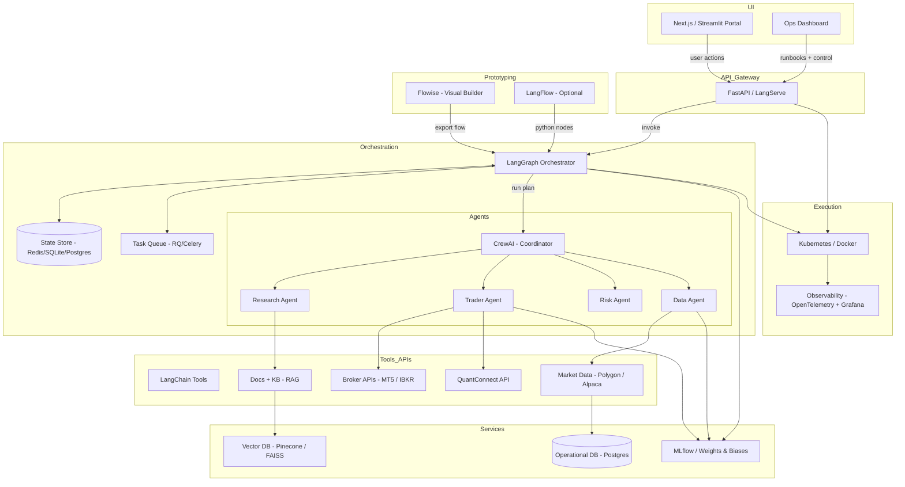

# AI Agent Stack – Flowise → CrewAI → LangGraph → FastAPI

---

### Notes

* **Agents** are now visually **nested under the Orchestration** layer for a clearer vertical hierarchy.
* **Flowise** for rapid prototyping of chains/agents; export flows to **LangGraph** for deterministic, stateful orchestration.
* **CrewAI** models the human-like team (Coordinator → Research / Trader / Risk / Data) while **LangGraph** controls retries, branching, checkpointing.
* **FastAPI/LangServe** exposes clean endpoints to the portal and external systems.
* **Observability** (OpenTelemetry + Grafana) instruments the graph, agents, and tool calls.
* **Experiment tracking** via MLflow or Weights & Biases.
* **Deploy** on Docker/Kubernetes; use Redis or Postgres for state and queues.
