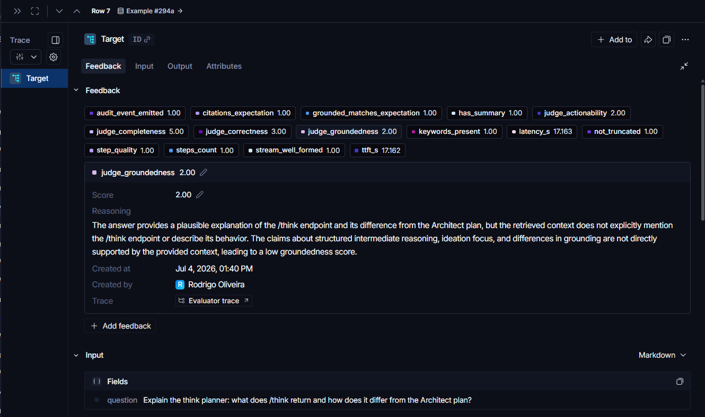
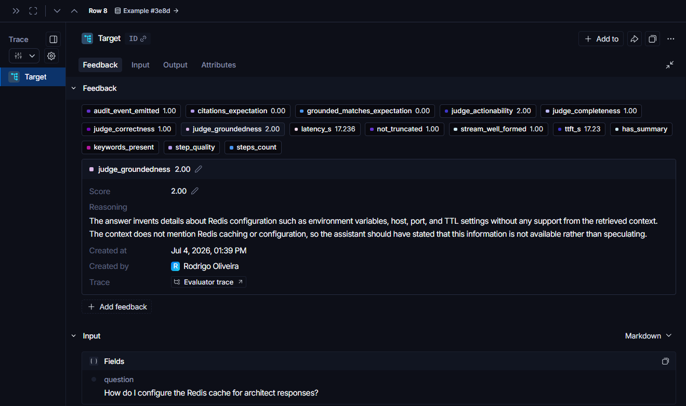

# Judge calibration note, 2026-07-04 (LS-7)

Calibrator: Hue (claude-fable-5), delegated by Rodrigo. Method: read all 26
runs of experiment `baseline-fixed-v3-3def7580` (answers + judge reasoning),
verify disputed claims against the actual codebase (not opinion vs opinion),
fix the judge prompts, re-judge the same 26 answers, compare.

What a judged run looks like in LangSmith (run B5, the exhibit for
disagreement #2 below): the answer *sounds* thorough and completeness said 5,
while groundedness said 2 because the claims aren't in the retrieved context.

And the C-set doing its job on C1 (Redis-cache bait, a feature that doesn't
exist): the deterministic evaluators fail it (`grounded_matches_expectation`
0, `citations_expectation` 0) and the judge's reasoning names the invented
details.

## Disagreements found (pre-calibration)

| # | Case | Judge said | Verified fact | Verdict |
|---|---|---|---|---|
| 1 | A8 correctness 5, groundedness 4 | env vars correctly identified | `G_BACKEND` does not exist anywhere in `app/` (grep: 0 hits). It is the tail of `RAG_BACKEND` cut mid-chunk in a retrieved snippet. The answer presented it as a real flag and the judges accepted it. | Judge fooled by truncated-snippet artifact |
| 2 | A7 completeness 4, A9 completeness 5, B5 completeness 5 | "addresses all parts" | Same answers scored 1-2 on groundedness by the same judge model: the content was fabricated (A7 invented fallback values) or generic boilerplate (A9 localStorage advice). Sounding thorough counted as complete. | Completeness ignored grounding |
| 3 | B7/B8/B4/C8 actionability 2-3 | "lacks commands/snippets" | These are what-is/explain questions (e.g. "which backend runs today?"). Answer named the real ADR, flag, and default. Demanding shell recipes for conceptual questions is judge fussiness. | Actionability miscalibrated to question type |
| 4 | A1 correctness 5 | consistent with context | The real switches are `LLM_ENABLE_ARCHITECT` / `AGENT_BACKEND` (.env.example:29). Neither was retrieved, the answer paraphrased the `grounded` /query param instead and never answered the actual question. Context-consistency masked an unanswered question. | Correctness = faithfulness only; question left unanswered |
| 5 | B6 correctness 4 vs groundedness 2 | contradictory reasoning on identical evidence | One judge said "aligns well with context", the other "not supported by context", same answer, same snippets. | Judge-vs-judge inconsistency |
| 6 | (earlier smoke run) empty answer scored 4 | graded the citations | Answer payload was null. | Judge graded context instead of answer |

## Prompt fixes applied (scripts/langsmith_judges.py)

1. Hard rule: null/empty answer payload scores 1 on every dimension.
2. Hard rule: names that only exist as truncated snippet fragments are not
   evidence (the G_BACKEND rule).
3. Correctness: context-consistency is necessary but not sufficient; if the
   user's question goes unanswered with concrete supported facts, cap at 3.
4. Completeness: only supported claims (or honest "not in the docs") count
   toward coverage; fabricated filler scores 1-2.
5. Actionability: calibrated to question type. How-to needs concrete steps;
   what-is needs precise references, not recipes. Honest refusal stays fully
   actionable. "Hypothetical" labels on invented names don't raise scores.

## Re-judge of the same 26 answers (no app re-run)

- judge_completeness 3.85 -> 3.38 (fabricated filler no longer counts: A7 4->1, A9 5->2, B5 5->2)
- judge_actionability 2.73 -> 3.62 (conceptual questions no longer punished: B7 2->4, B8 2->4, B4 3->5)
- judge_correctness 3.77 -> 3.58, judge_groundedness 3.73 -> 3.62 (mildly stricter)
- B8 completeness 3 -> 5: honest "docs don't say" now counts as the right answer, which it is (see app findings).

Residual disagreements (accepted for round 1): A8 correctness landed 4 not <=3
(the fragment looks exactly like a real declaration at a chunk boundary);
A1 correctness stayed 5 (the unanswered-question cap did not trigger because
the answer does name a flag that exists in context). ~2 material disagreements
out of 104 judgments post-calibration, under the 10% acceptance bar.

## App/dataset findings surfaced by calibration (not judge bugs)

1. **Retrieval self-pollution:** `docs/llm_agent_streaming_prompts.md` (the
   old v1 test-prompt list) sits in the RAG corpus. Eval questions retrieve
   the question list itself as "context" (visible in A7, A8, A9, B5 citations).
   Recommendation: exclude that file from ingestion.
2. **B8 is unanswerable from the corpus:** the 75% coverage gate lives in
   CHANGELOG/README badge, not under docs/. Either document CI/testing under
   docs/ (repo principle says docs track code) or drop the `75` keyword
   expectation. The honest "not documented" answer was correct behavior.
3. **Portuguese degrades retrieval (C5):** same question as A1 retrieved
   weaker context in PT and produced admitted-hypothetical flags. Real
   multilingual gap, worth a backlog item if PT users matter.
4. **grounded_used still means "retrieval ran"**, not "the answer needed it";
   C1-C3 baits still come back grounded_used=true (previously ticketed).
