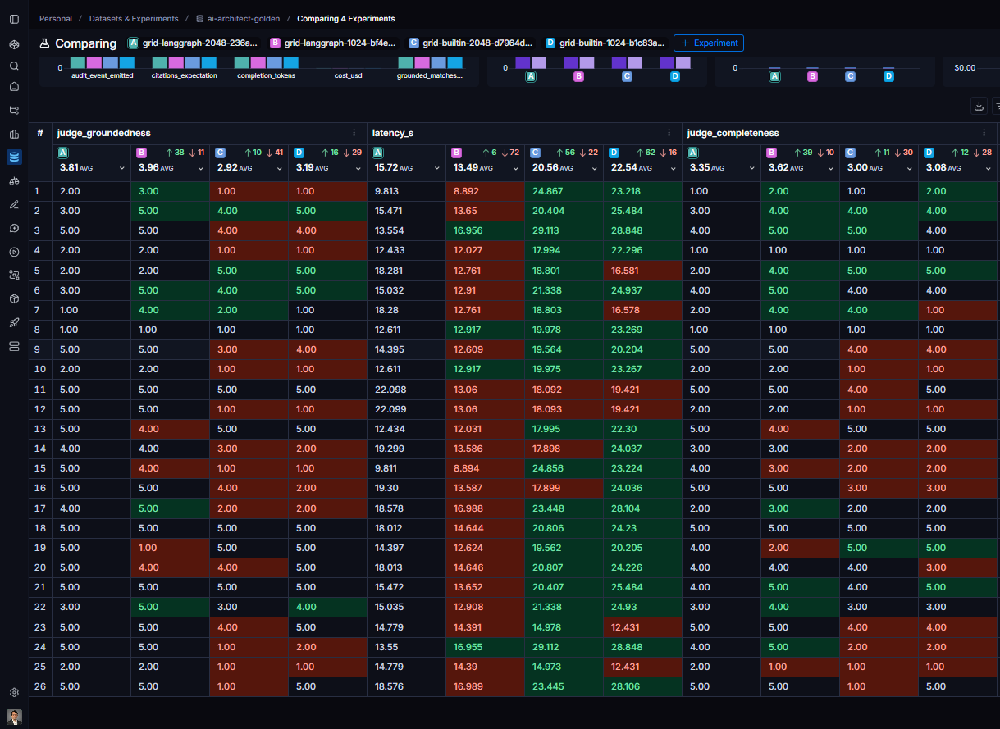
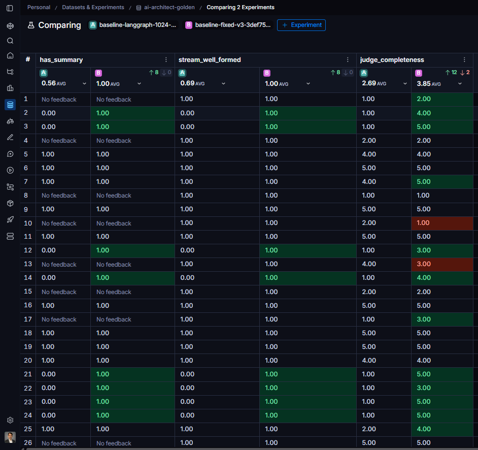

# LS-8 experiment: AGENT_BACKEND x LLM_MAX_TOKENS (2026-07-04)

2x2 grid, 26-prompt `ai-architect-golden` dataset per cell, calibrated judges
(see `eval_calibration_2026-07-04.md`), clean corpus (post PR #23), model
gpt-4.1, temperature 0. Experiments (LangSmith):

| cell | experiment |
|---|---|
| builtin-1024 | grid-builtin-1024-b1c83aac |
| builtin-2048 | grid-builtin-2048-d7964d89 |
| langgraph-1024 | grid-langgraph-1024-bf4e26be |
| langgraph-2048 | grid-langgraph-2048-236ad1f9 |

Every cell's `audit.agent_backend` was verified against the intended config.

## Results (per-cell averages)

| metric | builtin-1024 | builtin-2048 | langgraph-1024 | langgraph-2048 |
|---|---|---|---|---|
| judge_correctness | 3.54 | 3.23 | **3.81** | 3.73 |
| judge_groundedness | 3.19 | 2.92 | **3.96** | 3.81 |
| judge_completeness | 3.08 | 3.00 | **3.62** | 3.35 |
| judge_actionability | 3.69 | 3.77 | 3.38 | 3.69 |
| has_summary | 0.94 | 0.94 | 1.00 | 1.00 |
| not_truncated | 1.00 | 1.00 | 1.00 | 1.00 |
| completion_tokens (avg) | 319 | 333 | 281 | 277 |
| latency_s (avg) | 22.5 | 20.6 | **13.5** | 15.7 |
| cost_usd (avg/request) | ~equal across cells (fractions of a cent) | | | |

*LangSmith comparison view of the four cells (A = grid-langgraph-2048, B = grid-langgraph-1024, C = grid-builtin-2048, D = grid-builtin-1024). Column B takes groundedness (3.96) and latency (13.49s) row by row, not just on the averages; completeness barely moves across the token axis.*

## Verdict

**Backend axis: langgraph wins, decisively.** Better on groundedness
(+0.77 to +0.89, the metric that matters most for a RAG assistant), better on
correctness and completeness, AND ~7-9s faster per request despite making up
to 4 LLM turns; the builtin path's fixed pipeline (memory + multi-variant
retrieval + single big prompt) costs more wall-clock than the tool loop.
Actionability is the one metric where builtin edges ahead at 1024; it
equalizes at 2048 and doesn't outweigh the groundedness gap. Post-#21 (cap
warning + fallback), langgraph also no longer produces empty plans (1.00
has_summary).

**Token axis: dead, 1024 wins for free.** No run in any cell hit the cap
(max avg completion 333 tokens vs 1024 budget; not_truncated 1.00
everywhere), and 2048 bought no completeness (it dipped slightly, noise).
The 2026-07-04 worry that 1024 might truncate C8-style answers is measured
and dismissed.

**.env setting: `AGENT_BACKEND=langgraph`, `LLM_MAX_TOKENS=1024`**, which is
what it already was; the config survives, now with evidence instead of vibes.

## Notes / carry-forward

- `grounded_matches_expectation` flat at 0.846 across all cells: the C-set
  hallucination baits fail it identically regardless of backend/tokens.
  Confirms it's a retrieval-semantics issue (`grounded_used` = "retrieval
  ran"), not a generation issue. Still the standing design ticket.
- LS-9 design correction: `RAG_MULTI_QUERY_ENABLED` / `RAG_HYDE_ENABLED` only
  affect the keyword-scan path; with `RAG_BACKEND=vector` (current prod) they
  are no-ops. The useful round-two axes are `RAG_BACKEND` vector vs
  keyword_scan, and the model shootout (gpt-4.1 vs gpt-4.1-mini with judges
  upgraded via `EVAL_JUDGE_MODEL`).
- Grid mechanics: `scripts/run_experiment_grid.py` cycles .env per cell
  (touch app/main.py to trip the uvicorn reloader), waits for /healthz, and
  verifies each experiment's audit backend. .env is restored afterwards.

## Appendix: the empty-plan fix, before/after (PR #21)

Same dataset, same evaluators, pre-fix baseline
(`baseline-langgraph-1024-d56ebd31`) vs post-fix
(`baseline-fixed-v3-3def7580`). The "No feedback" cells in column A are the
empty plans themselves: 8 of 18 structured prompts came back with no summary
and no steps because the LangGraph agent exhausted its tool budget and
finalized silently. Post-fix, has_summary and stream_well_formed hit 1.00
across the board.

